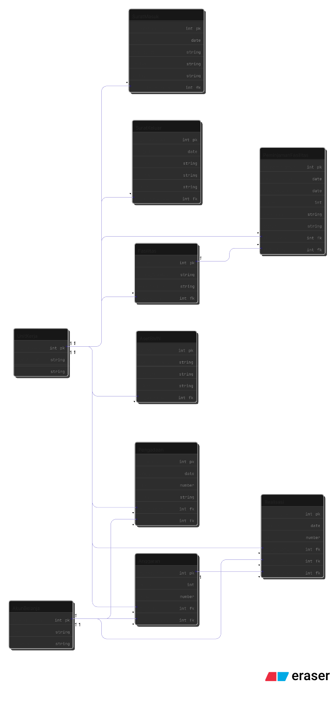

# Data Mart Non-Akademik – Kelompok 3  
Tugas Besar Data Warehouse – Institut Teknologi Sumatera  
**Misi 1 – Business Understanding & Dimensional Modeling**

---

## 👥 Anggota Kelompok (Urut NIM)
- **122450046 – Vita Anggraini**
- **123450034 – Kharisma Mustika Sari**
- **123450060 – Ridho Benedictus Togi Manik**
- **123450105 – Arielva Simon Siahaan**

---

# 1. Business Understanding

## 1.1 Domain Scope
Data Mart Non-Akademik berfokus pada aktivitas administratif dan operasional ITERA sesuai struktur organisasi ITERA pada website institusi, meliputi:

- Pengelolaan Anggaran  
- Realisasi Anggaran  
- Pengadaan Barang/Jasa  
- Pengelolaan Aset/BMN  
- Pengelolaan Fasilitas  
- Peminjaman Fasilitas  
- Surat Masuk dan Surat Keluar  

Unit Kerja menjadi entitas pusat karena semua aktivitas non-akademik berhubungan langsung dengan unit kerja.

---

## 1.2 Stakeholder Identification

**Primary Users**
- Bagian Umum dan Kepegawaian  
- Subbag Keuangan & BMN  
- Bagian Umum dan Keuangan  
- Biro Umum dan Akademik  

**Decision Maker**
- Wakil Rektor Bidang Non-Akademik (Keuangan, dan Umum)

**Supporting Stakeholders**
- Seluruh Unit Kerja ITERA  
- Dosen & Tendik  
- Mahasiswa  

---

## 1.3 Business Process Analysis

Proses yang dimodel meliputi:
- Anggaran  
- Realisasi anggaran  
- Pengadaan  
- BMN  
- Fasilitas  
- Peminjaman fasilitas  
- Surat masuk  
- Surat keluar  

Setiap proses dianalisis berdasarkan alur, atribut, dan hubungannya dengan Unit Kerja.

---

## 1.4 Analytical Requirements

Pertanyaan analitik utama:
- Alokasi anggaran per unit & per akun belanja  
- Pemanfaatan anggaran (pagu vs realisasi)  
- Kinerja pengadaan  
- Distribusi aset & tanggung jawab unit  
- Frekuensi dan durasi peminjaman fasilitas  
- Analisis surat masuk/keluar berdasar waktu, perihal, dan status  

Grain laporan: transaksi dan dokumen.  
Periode analisis: harian, mingguan, bulanan, tahunan.

---

# 2. Data Source Identification

## 2.1 Sumber Data
- Dokumen Laporan Keuangan ITERA Semester I 2025  
- Dokumen persuratan  
- Informasi struktur Unit Kerja  
- Asumsi data operasional (surat, fasilitas, BMN)  

## 2.2 Data Profiling
- Keuangan: konsisten  
- Persuratan: variasi perihal & status  
- Fasilitas: potensi overlapping  
- BMN: memiliki kategori & lokasi  

---

# 3. Conceptual Design (ERD)

### 📌 ERD

ERD dibangun berdasarkan entitas berikut:
- Unit Kerja  
- Anggaran  
- Realisasi  
- Akun Belanja  
- Pengadaan  
- Aset/BMN  
- Fasilitas  
- Peminjaman Fasilitas  
- Surat Masuk  
- Surat Keluar  

Relationship antar entitas mengikuti deskripsi di dokumen Misi I.

---

# 4. Logical Design (Dimensional Model)

### 📌 Dimensional Model

### Fact Tables
- Fact_Realisasi  
- Fact_Pengadaan  
- Fact_PeminjamanFasilitas  
- Fact_SuratMasuk  
- Fact_SuratKeluar  

### Dimension Tables
- DimUnitKerja  
- DimAkunBelanja  
- DimFasilitas  
- DimBMN  
- DimStatus  
- DimTanggal  
- DimKeperluan  
- DimPerihal  
- DimKategoriPengadaan  

---

# 5. Data Dictionary  
Data Dictionary untuk seluruh **fact** dan **dimension** SUDAH tersedia dan terdokumentasi lengkap di dalam laporan.

Dokumen tersebut berisi:
- nama tabel  
- atribut/kolom  
- tipe data  
- primary key / foreign key  
- deskripsi kolom  
- business rule per entitas  

---

# 6. Repository Checklist (Misi 1)

- [x] Business Requirements  
- [x] Identifikasi Sumber Data  
- [x] ERD selesai dan diupload  
- [x] Dimensional Model selesai dan diupload  
- [x] Data Dictionary ada dalam dokumen PDF  
- [x] README selesai  

---

# 7. Isi Folder `/docs`
Folder `/docs` berisi file:
- `ERD.png`  
- `dimensional-model.png`
- dokemen lainnya
